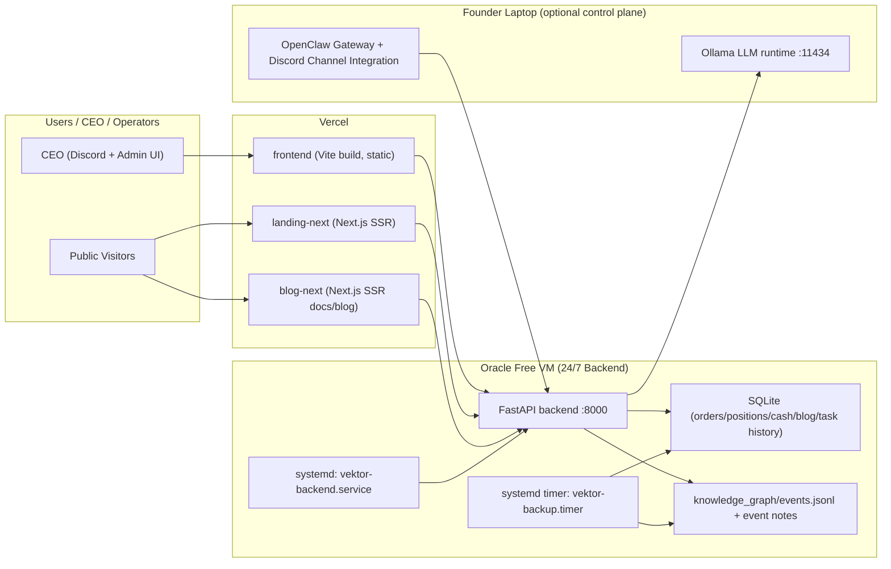
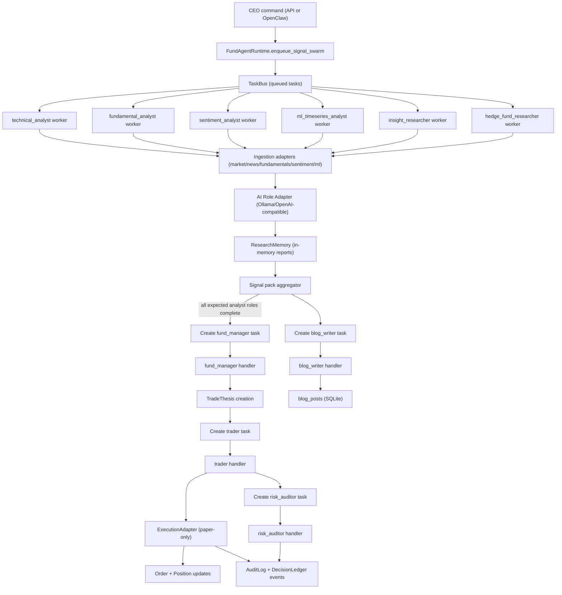
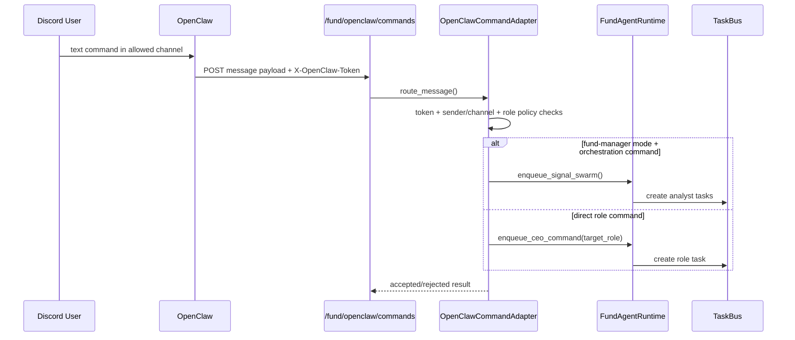
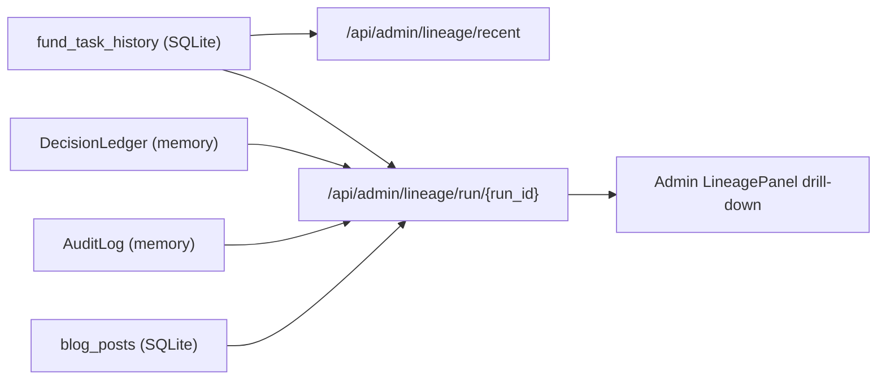

# Vektor Implementation Audit and Detailed Architecture Diagrams

Date: 2026-04-19  
Repo: `TradingBot`  
Scope: code-level audit of deployment topology, agent runtime, orchestration, lineage, persistence, and control surfaces.

## 1) Runtime Status Snapshot (from this audit session)

- Backend reachability at `http://127.0.0.1:8000`: not reachable during audit.
- Ollama reachability at `http://127.0.0.1:11434`: not reachable during audit.
- Backend tests: `69 passed` (`py -3 -m pytest backend/tests -q`).

This document is therefore implementation-accurate from source code and tests, but not from live in-process runtime telemetry.

## 2) Deployment Topology (Current Intended Model)

### 2.1 Local development ports

- Backend API: `8000`
- Frontend Admin/Product (Vite): `9000`
- Landing site (Next): `3000`
- Blog site (Next/Fumadocs): `3001`

### 2.2 Production-lean topology (as implemented in repo docs/scripts)

## 3) Backend Service Composition

`backend/app/main.py` composes:

- Fund router (`/fund/*`) for orchestration/runtime/openclaw/knowledge.
- Admin + research + blog APIs (`/api/admin/*`, `/api/research/*`, `/api/blog/*`).
- Monitoring APIs.
- Knowledge APIs.
- WebSocket streams (`/ws`, `/ws/agents`) and fund event stream (`/fund/stream`).

Startup actions include:

- DB init.
- task history restore from DB (lineage continuity for tasks).
- knowledge/event sinks wiring.
- broker restore from DB.
- stream loop startup.
- fund agent runtime startup (if enabled).

## 4) Agent Runtime and Orchestration (Detailed)

The orchestrated runtime is in `backend/app/fund/agent_runtime.py` and `backend/app/fund/orchestrator.py`.

### 4.1 Role map

- Analyst roles:
  - `technical_analyst`
  - `fundamental_analyst`
  - `sentiment_analyst`
  - `ml_timeseries_analyst`
  - `insight_researcher`
  - `hedge_fund_researcher`
- Execution/control roles:
  - `fund_manager`
  - `trader`
  - `risk_auditor`
  - `blog_writer`

### 4.2 End-to-end swarm flow

### 4.3 OpenClaw command path

## 5) Data Integrity, Session Guard, and Halt Semantics

`runtime_guard.py` enforces strict real-data mode:

- provider events recorded as `provider|fallback|failed`.
- if `REAL_DATA_STRICT_MODE=true` and any fallback/failed event occurs:
  - system halt is tripped.
  - worker queue entries are blocked.
  - orchestration degrades and execution stops.

`market_session.py` + runtime session guard enforce:

- market-closed/weekend/holiday gating via Alpaca clock/calendar (with weekday fallback).
- fund manager/trader paths return `hold_cash`/blocked outcomes outside tradable sessions when configured.

## 6) Persistence and Lineage Model

### 6.1 What is persisted

- SQLite (`backend/app/storage`):
  - orders
  - positions
  - cash snapshots
  - `fund_task_history` (task lifecycle events)
  - blog posts
- Knowledge graph filesystem:
  - `knowledge_graph/events.jsonl`
  - `knowledge_graph/events/*.md` notes
  - optional graphify sync command.

### 6.2 What is currently in-memory only

- Decision ledger entries/events (`DecisionLedger`).
- Audit events (`AuditLog`).
- Research reports (`ResearchMemoryStore`).
- Sentiment snapshots (`SentimentIngestService`).

These are exposed in runtime/admin APIs, but do not survive restart unless mirrored through task-history/knowledge captures.

### 6.3 Lineage drill-down implementation

Admin lineage uses:

- recent lineage aggregation from task history/events.
- run drill-down endpoint combining:
  - decision detail
  - audit timeline
  - related research report IDs
  - related blog post IDs/posts

## 7) Admin UI Operational Status Badges

`/api/admin/system/status-badges` drives badges:

- Orchestration: `Healthy | Degraded`
- Data Source: `Provider | Fallback`
- Execution Mode: `Paper Only | Degraded`
- LLM Agent Health: aggregate + per-role status

Inputs are pulled from runtime status (`fund_agent_runtime.status()`), data integrity guard, broker mode, and AI role adapter health.

## 8) Real-vs-Fallback Data Behavior

Market/news ingestion adapters record provider events and react to strict mode:

- Provider examples:
  - Alpaca stream
  - Alpaca latest trade/bars
  - Finnhub company news
- Fallback examples:
  - cache fallback
  - missing credentials
  - synthetic/test fallback

With strict mode enabled, fallback events halt runtime and block further activity.

## 9) Audit Findings (Repo-Accurate)

### 9.1 Implemented and aligned with target direction

- Multi-role worker runtime with analyst + fund manager + trader + risk + blog writer.
- OpenClaw command adapter with token auth and channel/sender/role policy filters.
- Strict real-data halt guard integrated with runtime blocking.
- Paper-only execution adapter and policy gate constraints.
- Admin lineage drill-down including decision + audit + related IDs.
- SQLite task-history persistence so core lineage survives restarts.
- Knowledge graph namespace policy and development log ingestion path.

### 9.2 Gaps to close for institutional-grade durability

- Decision ledger, audit log, research memory, sentiment stores should be persisted (DB-backed) for full restart continuity.
- Backend and Ollama need supervised runtime processes in dev if local mode is expected to stay up.
- OpenClaw runtime itself is external and must be supervised independently (outside repo process control).
- Production free-tier topology still depends on laptop availability for local Ollama/OpenClaw; backend must fail safe when laptop is offline.

## 10) Exact Files Audited (Core)

- Backend composition:
  - `backend/app/main.py`
  - `backend/app/config.py`
  - `backend/app/fund/router.py`
  - `backend/app/admin_research_routes.py`
- Runtime/orchestration:
  - `backend/app/fund/agent_runtime.py`
  - `backend/app/fund/orchestrator.py`
  - `backend/app/fund/task_bus.py`
  - `backend/app/fund/ai_role_adapter.py`
  - `backend/app/fund/openclaw_command_adapter.py`
  - `backend/app/fund/openclaw_ingest.py`
  - `backend/app/fund/policy_gate.py`
  - `backend/app/fund/execution_adapter.py`
  - `backend/app/fund/runtime_guard.py`
  - `backend/app/fund/market_session.py`
  - `backend/app/fund/knowledge_graph.py`
  - `backend/app/fund/blog_service.py`
  - `backend/app/fund/research_memory.py`
  - `backend/app/fund/sentiment_ingest.py`
  - `backend/app/fund/decision_ledger.py`
  - `backend/app/fund/audit_log.py`
  - `backend/app/websocket/agent_events.py`
- Data + broker:
  - `backend/app/data/market_data.py`
  - `backend/app/data/news.py`
  - `backend/app/broker/paper.py`
  - `backend/app/storage/db.py`
  - `backend/app/storage/schema_sql.py`
- Frontend admin surfaces:
  - `frontend/src/pages/Admin.jsx`
  - `frontend/src/components/admin/LineagePanel.jsx`
  - `frontend/src/components/admin/SystemOverview.jsx`
  - `frontend/src/api/adminAPI.js`
- Deployment docs/scripts:
  - `docs/DEPLOY_ORACLE_FREE_VM.md`
  - `docs/DEPLOY_VERCEL_AZURE.md`
  - `scripts/deploy-azure-backend.ps1`
  - `scripts/deploy-vercel-frontend.ps1`
  - `scripts/deploy-all.ps1`
